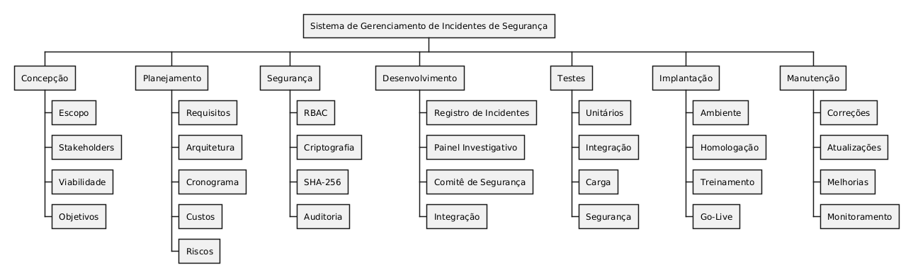
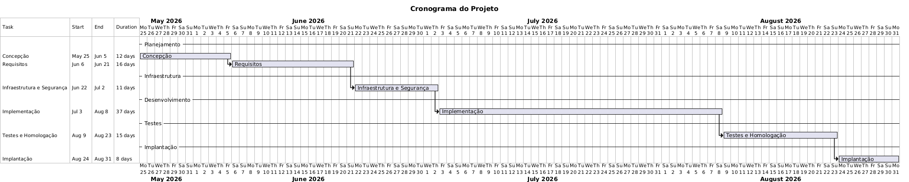

````md
# 🛡️ Sistema de Gerenciamento de Incidentes de Segurança

> Projeto acadêmico de Engenharia de Software voltado à análise, modelagem e planejamento de uma solução para gerenciamento de incidentes de segurança da informação.

<p align="center">
  
  
  
  
</p>

---

# 📖 Visão Geral

O Sistema de Gerenciamento de Incidentes de Segurança foi desenvolvido como projeto acadêmico com o objetivo de aplicar conceitos de Engenharia de Software, Segurança da Informação e Gestão de Projetos na concepção de uma solução voltada ao tratamento de incidentes de segurança.

O projeto contempla atividades de levantamento de requisitos, modelagem UML, análise de riscos, planejamento do desenvolvimento, definição de controles de segurança e documentação dos artefatos produzidos durante o ciclo de vida do software.

---

# 🎯 Objetivos

- Registrar incidentes de segurança da informação;
- Garantir rastreabilidade das ações executadas;
- Preservar evidências digitais;
- Apoiar investigações e auditorias;
- Controlar o fluxo de aprovação dos incidentes;
- Apoiar a tomada de decisão do Comitê de Segurança;
- Fornecer histórico completo das ocorrências;
- Padronizar o tratamento de incidentes.

---

# 🚨 Problema de Negócio

Incidentes de segurança precisam ser registrados, investigados e resolvidos de forma estruturada.

Sem um processo adequado, organizações podem enfrentar problemas como:

- Perda de evidências digitais;
- Falhas de auditoria;
- Erros de comunicação;
- Dificuldade de investigação;
- Não conformidade com políticas internas;
- Atrasos na resposta aos incidentes.

Este projeto propõe uma solução capaz de centralizar e padronizar todo o processo de gerenciamento de incidentes.

---

# 🔄 Fluxo de Tratamento de Incidentes

```text
Usuário
   ↓
Registro do Incidente
   ↓
Classificação e Priorização
   ↓
Investigação
   ↓
Registro de Evidências
   ↓
Análise do Comitê de Segurança
   ↓
Resolução
   ↓
Relatório Final
   ↓
Encerramento
````

---

# 👥 Atores do Sistema

| Ator                  | Responsabilidade                       |
| --------------------- | -------------------------------------- |
| Usuário               | Reportar incidentes de segurança       |
| Analista de Segurança | Investigar e acompanhar incidentes     |
| Comitê de Segurança   | Avaliar riscos e aprovar encerramentos |

---

# 📋 Funcionalidades Principais

* Registro de incidentes;
* Atualização de ocorrências;
* Classificação e priorização;
* Investigação de eventos;
* Controle de evidências digitais;
* Consulta de relatórios;
* Fluxo de aprovação;
* Auditoria e rastreabilidade.

---

# 📊 Estrutura Analítica do Projeto (EAP)

A Estrutura Analítica do Projeto organiza as atividades necessárias para o desenvolvimento da solução.



---

# 📅 Cronograma do Projeto

O cronograma foi elaborado para organizar as fases do projeto desde a concepção até a implantação.



---

# 📌 Resumo do Cronograma

| Etapa                      | Objetivo                                                 | Duração |
| -------------------------- | -------------------------------------------------------- | ------- |
| Concepção                  | Definição do escopo e objetivos                          | 12 dias |
| Levantamento de Requisitos | Identificação dos requisitos funcionais e não funcionais | 16 dias |
| Infraestrutura e Segurança | Planejamento do ambiente e controles de segurança        | 11 dias |
| Desenvolvimento            | Construção da solução                                    | 37 dias |
| Testes e Homologação       | Validação funcional e técnica                            | 15 dias |
| Implantação                | Entrega e homologação final                              | 8 dias  |

**Duração total planejada:** 99 dias.

---

# ⚠️ Gestão de Riscos

A análise de riscos foi utilizada para orientar decisões arquiteturais e requisitos de segurança.

## Principais Riscos

| Risco                               | Impacto | Probabilidade |
| ----------------------------------- | ------- | ------------- |
| Vazamento de informações sigilosas  | Alto    | Média         |
| Perda de evidências digitais        | Alto    | Média         |
| Indisponibilidade do sistema        | Alto    | Baixa         |
| Sobrecarga da plataforma            | Alto    | Baixa         |
| Falhas de permissões                | Médio   | Média         |
| Atraso no desenvolvimento           | Médio   | Alta          |
| Erros humanos durante investigações | Médio   | Média         |

### Estratégias de Mitigação

* Controle de acesso baseado em papéis (RBAC);
* Restrição de permissões por perfil;
* Utilização de hashes SHA-256;
* Auditoria e rastreabilidade das ações;
* Backups periódicos;
* Testes de autenticação e autorização;
* Testes de carga;
* Monitoramento contínuo.

---

# 🔒 Requisitos de Segurança

## Controle de Acesso

* RBAC (Role-Based Access Control);
* Controle granular de permissões;
* Perfis de usuário.

## Integridade

* Utilização de hashes SHA-256 para validação de evidências;
* Controle de integridade dos registros.

## Auditoria

* Registro das ações executadas;
* Histórico de alterações;
* Rastreabilidade completa.

---

# 📂 Estrutura do Repositório

```text
.
├── README.md
└── gerenciamento-de-incidentes-de-seguranca/
    ├── Concepção/
    ├── Exercícios/
    ├── EAP.png
    ├── GANTT.png
    ├── GroupInformation.md
    ├── SquadGrupoKaua.md
    ├── riscos.md
    └── demais artefatos do projeto
```

---

# 🧠 Competências Demonstradas

Este projeto evidencia conhecimentos em:

* Engenharia de Requisitos;
* UML e Modelagem de Sistemas;
* Segurança da Informação;
* Gestão de Riscos;
* Planejamento de Projetos;
* Governança de TI;
* Auditoria de Sistemas;
* Documentação Técnica;
* Boas Práticas de Engenharia de Software.

---

# 👨‍💻 Equipe

* Guilherme Shinohara
* Kauã de Castro Alencar
* Kauan Sarzi da Rocha
* Ricardo Kiyoshi Kawamuro

---

# 📌 Status

✅ Projeto concluído

Este projeto demonstra a aplicação prática de conceitos de Engenharia de Software, Segurança da Informação e Gestão de Projetos por meio da análise, modelagem, planejamento e documentação de uma solução para gerenciamento de incidentes de segurança da informação.

````

