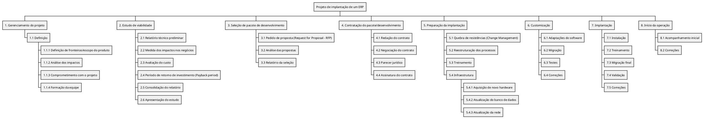

```plantuml
@startwbs
* Projeto de implantação de um ERP

** 1. Gerenciamento do projeto
*** 1.1 Definição
**** 1.1.1 Definição de fronteiras/escopo do produto
**** 1.1.2 Análise dos impactos
**** 1.1.3 Comprometimento com o projeto
**** 1.1.4 Formação da equipe
** 2. Estudo de viabilidade
*** 2.1 Relatório técnico preliminar
*** 2.2 Medida dos impactos nos negócios
*** 2.3 Avaliação do custo
*** 2.4 Período de retorno de investimento (Payback period)
*** 2.5 Consolidação do relatório
*** 2.6 Apresentação do estudo
** 3. Seleção de pacote de desenvolvimento
*** 3.1 Pedido de proposta (Request for Proposal - RFP)
*** 3.2 Análise das propostas
*** 3.3 Relatório da seleção
** 4. Contratação do pacote/desenvolvimento
*** 4.1 Redação do contrato
*** 4.2 Negociação do contrato
*** 4.3 Parecer jurídico
*** 4.4 Assinatura do contrato
** 5. Preparação da implantação
*** 5.1 Quebra de resistências (Change Management)
*** 5.2 Reestruturação dos processos
*** 5.3 Treinamento
*** 5.4 Infraestrutura
**** 5.4.1 Aquisição de novo hardware
**** 5.4.2 Atualização do banco de dados
**** 5.4.3 Atualização da rede
** 6. Customização
*** 6.1 Adaptações do software
*** 6.2 Migração
*** 6.3 Testes
*** 6.4 Correções
** 7. Implantação
*** 7.1 Instalação
*** 7.2 Treinamento
*** 7.3 Migração final
*** 7.4 Validação
*** 7.5 Correções
** 8. Início da operação
*** 8.1 Acompanhamento inicial
*** 8.2 Correções
@endwbs
```