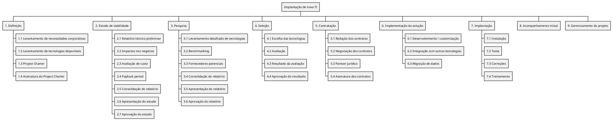

```plantuml
@startwbs
* Implantação de nova TI
** 1. Definição
*** 1.1 Levantamento de necessidades corporativas
*** 1.2 Levantamento de tecnologias disponíveis
*** 1.3 Project Charter
*** 1.4 Assinatura do Project Charter
** 2. Estudo de viabilidade
*** 2.1 Relatório técnico preliminar
*** 2.2 Impactos nos negócios
*** 2.3 Avaliação de custo
*** 2.4 Payback period
*** 2.5 Consolidação do relatório
*** 2.6 Apresentação do estudo
*** 2.7 Aprovação do estudo
** 3. Pesquisa
*** 3.1 Levantamento detalhado de tecnologias
*** 3.2 Benchmarking
*** 3.3 Fornecedores potenciais
*** 3.4 Consolidação do relatório
*** 3.5 Apresentação do relatório
*** 3.6 Aprovação do relatório
** 4. Seleção
*** 4.1 Escolha das tecnologias
*** 4.2 Avaliação
*** 4.3 Resultado da avaliação
*** 4.4 Aprovação do resultado
** 5. Contratação
*** 5.1 Redação dos contratos
*** 5.2 Negociação dos contratos
*** 5.3 Parecer jurídico
*** 5.4 Assinatura dos contratos
** 6. Implementação da solução
*** 6.1 Desenvolvimento / customização
*** 6.2 Integração com outras tecnologias
*** 6.3 Migração de dados
** 7. Implantação
*** 7.1 Instalação
*** 7.2 Teste
*** 7.3 Correções
*** 7.4 Treinamento
** 8. Acompanhamento inicial
** 9. Gerenciamento do projeto
@endwbs
```