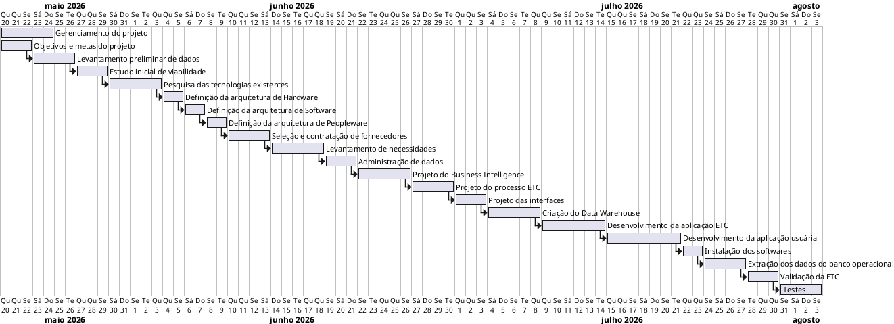

```plantuml
@startgantt
language pt
Project starts 2026-05-20

' =========================
' 1. Gerenciamento do projeto
' =========================
[Gerenciamento do projeto] lasts 5 days

' =========================
' 2. Concepção
' =========================
[Objetivos e metas do projeto] lasts 3 days
[Levantamento preliminar de dados] lasts 4 days
[Estudo inicial de viabilidade] lasts 3 days

[Levantamento preliminar de dados] starts at [Objetivos e metas do projeto]'s end
[Estudo inicial de viabilidade] starts at [Levantamento preliminar de dados]'s end

' =========================
' 3. Pesquisa das tecnologias
' =========================
[Pesquisa das tecnologias existentes] lasts 5 days
[Pesquisa das tecnologias existentes] starts at [Estudo inicial de viabilidade]'s end

' =========================
' 4. Definição das arquiteturas
' =========================
[Definição da arquitetura de Hardware] lasts 2 days
[Definição da arquitetura de Software] lasts 2 days
[Definição da arquitetura de Peopleware] lasts 2 days

[Definição da arquitetura de Hardware] starts at [Pesquisa das tecnologias existentes]'s end
[Definição da arquitetura de Software] starts at [Definição da arquitetura de Hardware]'s end
[Definição da arquitetura de Peopleware] starts at [Definição da arquitetura de Software]'s end

' =========================
' 5. Seleção de fornecedores
' =========================
[Seleção e contratação de fornecedores] lasts 4 days
[Seleção e contratação de fornecedores] starts at [Definição da arquitetura de Peopleware]'s end

' =========================
' 6. Projeto/modelagem dimensional
' =========================
[Levantamento de necessidades] lasts 5 days
[Administração de dados] lasts 3 days
[Projeto do Business Intelligence] lasts 5 days
[Projeto do processo ETC] lasts 4 days
[Projeto das interfaces] lasts 3 days

[Levantamento de necessidades] starts at [Seleção e contratação de fornecedores]'s end
[Administração de dados] starts at [Levantamento de necessidades]'s end
[Projeto do Business Intelligence] starts at [Administração de dados]'s end
[Projeto do processo ETC] starts at [Projeto do Business Intelligence]'s end
[Projeto das interfaces] starts at [Projeto do processo ETC]'s end

' =========================
' 7. Implementação / construção
' =========================
[Criação do Data Warehouse] lasts 5 days
[Desenvolvimento da aplicação ETC] lasts 6 days
[Desenvolvimento da aplicação usuária] lasts 7 days

[Criação do Data Warehouse] starts at [Projeto das interfaces]'s end
[Desenvolvimento da aplicação ETC] starts at [Criação do Data Warehouse]'s end
[Desenvolvimento da aplicação usuária] starts at [Desenvolvimento da aplicação ETC]'s end

' =========================
' 8. Implantação
' =========================
[Instalação dos softwares] lasts 2 days
[Extração dos dados do banco operacional] lasts 4 days
[Validação da ETC] lasts 3 days
[Testes] lasts 4 days

[Instalação dos softwares] starts at [Desenvolvimento da aplicação usuária]'s end
[Extração dos dados do banco operacional] starts at [Instalação dos softwares]'s end
[Validação da ETC] starts at [Extração dos dados do banco operacional]'s end
[Testes] starts at [Validação da ETC]'s end

@endgantt
```