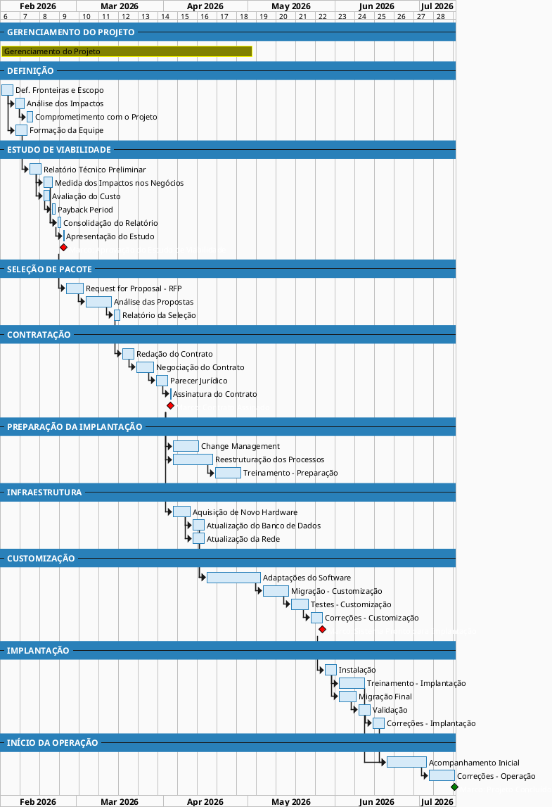

# Diagrama de Gantt

```plantuml
@startgantt

skinparam backgroundColor #FAFAFA
skinparam ganttArrowColor #2C3E50

<style>
ganttDiagram {
  task {
    FontName Helvetica
    FontSize 11
    FontColor black
    BackgroundColor #D6EAF8
    LineColor #2980B9
  }
  milestone {
    FontName Helvetica
    FontSize 11
    FontColor white
    BackgroundColor #1A3C5E
  }
  separator {
    FontName Helvetica
    BackgroundColor #2980B9
    FontColor white
    FontSize 12
    FontStyle bold
  }
}
</style>

Project starts 2026-02-02
printscale weekly

-- GERENCIAMENTO DO PROJETO --

[Gerenciamento do Projeto] as [GP] lasts 90 days
[GP] is colored in Olive/Yellow

-- DEFINIÇÃO --

[Def. Fronteiras e Escopo] as [DEF1] lasts 5 days
[Análise dos Impactos] as [DEF2] lasts 4 days
[Comprometimento com o Projeto] as [DEF3] lasts 3 days
[Formação da Equipe] as [DEF4] lasts 5 days

[DEF2] starts at [DEF1]'s end
[DEF3] starts at [DEF2]'s end
[DEF4] starts at [DEF1]'s end

-- ESTUDO DE VIABILIDADE --

[Relatório Técnico Preliminar] as [EV1] lasts 5 days
[Medida dos Impactos nos Negócios] as [EV2] lasts 4 days
[Avaliação do Custo] as [EV3] lasts 3 days
[Payback Period] as [EV4] lasts 2 days
[Consolidação do Relatório] as [EV5] lasts 2 days
[Apresentação do Estudo] as [EV6] lasts 1 day

[EV1] starts at [DEF4]'s end
[EV2] starts at [EV1]'s end
[EV3] starts at [EV1]'s end
[EV4] starts at [EV3]'s end
[EV5] starts at [EV2]'s end
[EV5] starts at [EV4]'s end
[EV6] starts at [EV5]'s end

[Marco: Aprovação do Estudo de Viabilidade] as [M1] lasts 0 days
[M1] happens at [EV6]'s end
[M1] is colored in Red/Black

-- SELEÇÃO DE PACOTE --

[Request for Proposal - RFP] as [SEL1] lasts 7 days
[Análise das Propostas] as [SEL2] lasts 10 days
[Relatório da Seleção] as [SEL3] lasts 3 days

[SEL1] starts at [M1]'s end
[SEL2] starts at [SEL1]'s end
[SEL3] starts at [SEL2]'s end

-- CONTRATAÇÃO --

[Redação do Contrato] as [CON1] lasts 5 days
[Negociação do Contrato] as [CON2] lasts 7 days
[Parecer Jurídico] as [CON3] lasts 5 days
[Assinatura do Contrato] as [CON4] lasts 1 day

[CON1] starts at [SEL3]'s end
[CON2] starts at [CON1]'s end
[CON3] starts at [CON2]'s end
[CON4] starts at [CON3]'s end

[Marco: Contrato Assinado] as [M2] lasts 0 days
[M2] happens at [CON4]'s end
[M2] is colored in Red/Black

-- PREPARAÇÃO DA IMPLANTAÇÃO --

[Change Management] as [PREP1] lasts 10 days
[Reestruturação dos Processos] as [PREP2] lasts 15 days
[Treinamento - Preparação] as [PREP3] lasts 10 days

[PREP1] starts at [M2]'s end
[PREP2] starts at [M2]'s end
[PREP3] starts at [PREP2]'s end

-- INFRAESTRUTURA --

[Aquisição de Novo Hardware] as [INF1] lasts 7 days
[Atualização do Banco de Dados] as [INF2] lasts 5 days
[Atualização da Rede] as [INF3] lasts 5 days

[INF1] starts at [M2]'s end
[INF2] starts at [INF1]'s end
[INF3] starts at [INF1]'s end

-- CUSTOMIZAÇÃO --

[Adaptações do Software] as [CUS1] lasts 20 days
[Migração - Customização] as [CUS2] lasts 10 days
[Testes - Customização] as [CUS3] lasts 7 days
[Correções - Customização] as [CUS4] lasts 5 days

[CUS1] starts at [INF2]'s end
[CUS1] starts at [INF3]'s end
[CUS2] starts at [CUS1]'s end
[CUS3] starts at [CUS2]'s end
[CUS4] starts at [CUS3]'s end

[Marco: Sistema Pronto para Implantação] as [M3] lasts 0 days
[M3] happens at [CUS4]'s end
[M3] is colored in Red/Black

-- IMPLANTAÇÃO --

[Instalação] as [IMP1] lasts 5 days
[Treinamento - Implantação] as [IMP2] lasts 10 days
[Migração Final] as [IMP3] lasts 7 days
[Validação] as [IMP4] lasts 5 days
[Correções - Implantação] as [IMP5] lasts 5 days

[IMP1] starts at [M3]'s end
[IMP2] starts at [IMP1]'s end
[IMP3] starts at [IMP1]'s end
[IMP4] starts at [IMP3]'s end
[IMP5] starts at [IMP4]'s end

-- INÍCIO DA OPERAÇÃO --

[Acompanhamento Inicial] as [OP1] lasts 15 days
[Correções - Operação] as [OP2] lasts 10 days

[OP1] starts at [IMP5]'s end
[OP1] starts at [IMP2]'s end
[OP2] starts at [OP1]'s end

[Marco: Projeto Concluído] as [M4] lasts 0 days
[M4] happens at [OP2]'s end
[M4] is colored in Green/Black

@endgantt
```