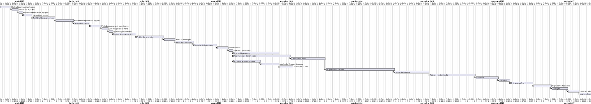

```plantuml
@startgantt
language pt
Project starts 2026-05-15

' =========================
' 1. Gerenciamento do projeto
' =========================
[Definição de fronteiras/escopo] lasts 5 days
[Análise dos impactos] lasts 3 days
[Comprometimento com o projeto] lasts 2 days
[Formação da equipe] lasts 4 days

[Análise dos impactos] starts at [Definição de fronteiras/escopo]'s end
[Comprometimento com o projeto] starts at [Análise dos impactos]'s end
[Formação da equipe] starts at [Comprometimento com o projeto]'s end

' =========================
' 2. Estudo de viabilidade
' =========================
[Relatório técnico preliminar] lasts 10 days
[Medida dos impactos nos negócios] lasts 8 days
[Avaliação do custo] lasts 7 days
[Período de retorno de investimento] lasts 5 days
[Consolidação do relatório] lasts 3 days
[Apresentação do estudo] lasts 2 days

[Relatório técnico preliminar] starts at [Formação da equipe]'s end
[Medida dos impactos nos negócios] starts at [Relatório técnico preliminar]'s end
[Avaliação do custo] starts at [Medida dos impactos nos negócios]'s end
[Período de retorno de investimento] starts at [Avaliação do custo]'s end
[Consolidação do relatório] starts at [Período de retorno de investimento]'s end
[Apresentação do estudo] starts at [Consolidação do relatório]'s end

' =========================
' 3. Seleção de pacote
' =========================
[Pedido de proposta - RFP] lasts 10 days
[Análise das propostas] lasts 12 days
[Relatório da seleção] lasts 5 days

[Pedido de proposta - RFP] starts at [Apresentação do estudo]'s end
[Análise das propostas] starts at [Pedido de proposta - RFP]'s end
[Relatório da seleção] starts at [Análise das propostas]'s end

' =========================
' 4. Contratação
' =========================
[Redação do contrato] lasts 8 days
[Negociação do contrato] lasts 10 days
[Parecer jurídico] lasts 5 days
[Assinatura do contrato] lasts 2 days

[Redação do contrato] starts at [Relatório da seleção]'s end
[Negociação do contrato] starts at [Redação do contrato]'s end
[Parecer jurídico] starts at [Negociação do contrato]'s end
[Assinatura do contrato] starts at [Parecer jurídico]'s end

' =========================
' 5. Preparação da implantação
' =========================
[Change Management] lasts 20 days
[Reestruturação dos processos] lasts 25 days
[Treinamento inicial] lasts 15 days
[Aquisição de novo hardware] lasts 12 days
[Atualização do banco de dados] lasts 8 days
[Atualização da rede] lasts 6 days

[Change Management] starts at [Assinatura do contrato]'s end
[Reestruturação dos processos] starts at [Assinatura do contrato]'s end
[Aquisição de novo hardware] starts at [Assinatura do contrato]'s end

[Treinamento inicial] starts at [Reestruturação dos processos]'s end
[Atualização do banco de dados] starts at [Aquisição de novo hardware]'s end
[Atualização da rede] starts at [Atualização do banco de dados]'s end

' =========================
' 6. Customização
' =========================
[Adaptações do software] lasts 30 days
[Migração de dados] lasts 15 days
[Testes de customização] lasts 20 days
[Correções] lasts 10 days

[Adaptações do software] starts at [Treinamento inicial]'s end
[Migração de dados] starts at [Adaptações do software]'s end
[Testes de customização] starts at [Migração de dados]'s end
[Correções] starts at [Testes de customização]'s end

' =========================
' 7. Implantação
' =========================
[Instalação] lasts 5 days
[Treinamento final] lasts 10 days
[Migração final de dados] lasts 8 days
[Validação] lasts 7 days
[Correções pós-implantação] lasts 5 days

[Instalação] starts at [Correções]'s end
[Treinamento final] starts at [Instalação]'s end
[Migração final de dados] starts at [Treinamento final]'s end
[Validação] starts at [Migração final de dados]'s end
[Correções pós-implantação] starts at [Validação]'s end

' =========================
' 8. Início da operação
' =========================
[Acompanhamento inicial] lasts 30 days
[Correções em produção] lasts 30 days

[Acompanhamento inicial] starts at [Correções pós-implantação]'s end
[Correções em produção] starts at [Acompanhamento inicial]'s end

@endgantt
```