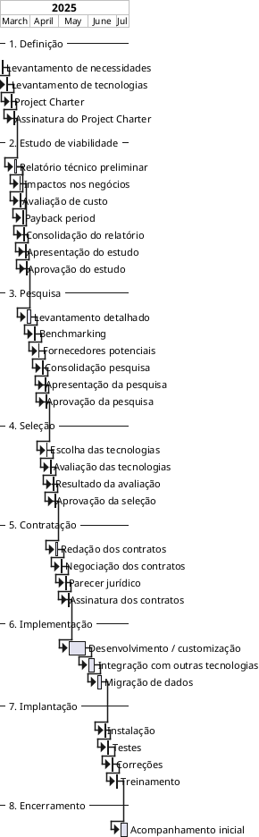

```plantuml
@startgantt
projectscale monthly
Project starts 2025-03-01
hide footbox

-- 1. Definição --
[Levantamento de necessidades]     lasts 5 days
[Levantamento de tecnologias]      lasts 5 days
[Levantamento de tecnologias] starts at [Levantamento de necessidades]'s end
[Project Charter]                  lasts 3 days
[Project Charter] starts at [Levantamento de tecnologias]'s end
[Assinatura do Project Charter]    lasts 1 day
[Assinatura do Project Charter] starts at [Project Charter]'s end

-- 2. Estudo de viabilidade --
[Relatório técnico preliminar]     lasts 5 days
[Relatório técnico preliminar] starts at [Assinatura do Project Charter]'s end
[Impactos nos negócios]            lasts 4 days
[Impactos nos negócios] starts at [Relatório técnico preliminar]'s end
[Avaliação de custo]               lasts 3 days
[Avaliação de custo] starts at [Relatório técnico preliminar]'s end
[Payback period]                   lasts 2 days
[Payback period] starts at [Avaliação de custo]'s end
[Consolidação do relatório]        lasts 2 days
[Consolidação do relatório] starts at [Impactos nos negócios]'s end
[Apresentação do estudo]           lasts 1 day
[Apresentação do estudo] starts at [Consolidação do relatório]'s end
[Aprovação do estudo]              lasts 1 day
[Aprovação do estudo] starts at [Apresentação do estudo]'s end

-- 3. Pesquisa --
[Levantamento detalhado]           lasts 7 days
[Levantamento detalhado] starts at [Aprovação do estudo]'s end
[Benchmarking]                     lasts 5 days
[Benchmarking] starts at [Levantamento detalhado]'s end
[Fornecedores potenciais]          lasts 4 days
[Fornecedores potenciais] starts at [Benchmarking]'s end
[Consolidação pesquisa]            lasts 2 days
[Consolidação pesquisa] starts at [Fornecedores potenciais]'s end
[Apresentação da pesquisa]         lasts 1 day
[Apresentação da pesquisa] starts at [Consolidação pesquisa]'s end
[Aprovação da pesquisa]            lasts 1 day
[Aprovação da pesquisa] starts at [Apresentação da pesquisa]'s end

-- 4. Seleção --
[Escolha das tecnologias]          lasts 4 days
[Escolha das tecnologias] starts at [Aprovação da pesquisa]'s end
[Avaliação das tecnologias]        lasts 3 days
[Avaliação das tecnologias] starts at [Escolha das tecnologias]'s end
[Resultado da avaliação]           lasts 2 days
[Resultado da avaliação] starts at [Avaliação das tecnologias]'s end
[Aprovação da seleção]             lasts 1 day
[Aprovação da seleção] starts at [Resultado da avaliação]'s end

-- 5. Contratação --
[Redação dos contratos]            lasts 5 days
[Redação dos contratos] starts at [Aprovação da seleção]'s end
[Negociação dos contratos]         lasts 5 days
[Negociação dos contratos] starts at [Redação dos contratos]'s end
[Parecer jurídico]                 lasts 3 days
[Parecer jurídico] starts at [Negociação dos contratos]'s end
[Assinatura dos contratos]         lasts 1 day
[Assinatura dos contratos] starts at [Parecer jurídico]'s end

-- 6. Implementação --
[Desenvolvimento / customização]   lasts 20 days
[Desenvolvimento / customização] starts at [Assinatura dos contratos]'s end
[Integração com outras tecnologias] lasts 10 days
[Integração com outras tecnologias] starts at [Desenvolvimento / customização]'s end
[Migração de dados]                lasts 7 days
[Migração de dados] starts at [Integração com outras tecnologias]'s end

-- 7. Implantação --
[Instalação]                       lasts 3 days
[Instalação] starts at [Migração de dados]'s end
[Testes]                           lasts 5 days
[Testes] starts at [Instalação]'s end
[Correções]                        lasts 4 days
[Correções] starts at [Testes]'s end
[Treinamento]                      lasts 5 days
[Treinamento] starts at [Correções]'s end

-- 8. Encerramento --
[Acompanhamento inicial]           lasts 10 days
[Acompanhamento inicial] starts at [Treinamento]'s end

@endgantt
```