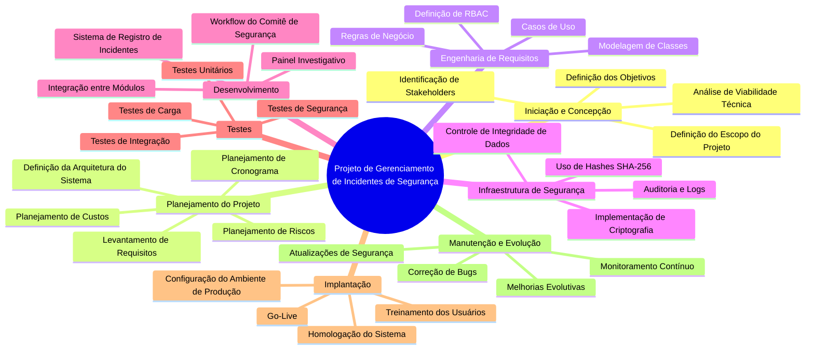

# 📊 Estrutura Analítica do Projeto (EAP)

```mermaid
mindmap
  root((Projeto de Gerenciamento de Incidentes de Segurança))

    Iniciação e Concepção
      Definição do Escopo do Projeto
      Identificação de Stakeholders
      Análise de Viabilidade Técnica
      Definição dos Objetivos

    Planejamento do Projeto
      Levantamento de Requisitos
      Definição da Arquitetura do Sistema
      Planejamento de Cronograma
      Planejamento de Custos
      Planejamento de Riscos

    Engenharia de Requisitos
      Casos de Uso
      Modelagem de Classes
      Definição de RBAC
      Regras de Negócio

    Infraestrutura de Segurança
      Implementação de Criptografia
      Uso de Hashes SHA-256
      Auditoria e Logs
      Controle de Integridade de Dados

    Desenvolvimento
      Sistema de Registro de Incidentes
      Painel Investigativo
      Workflow do Comitê de Segurança
      Integração entre Módulos

    Testes
      Testes Unitários
      Testes de Integração
      Testes de Carga
      Testes de Segurança

    Implantação
      Configuração do Ambiente de Produção
      Homologação do Sistema
      Treinamento dos Usuários
      Go-Live

    Manutenção e Evolução
      Correção de Bugs
      Atualizações de Segurança
      Melhorias Evolutivas
      Monitoramento Contínuo
```
