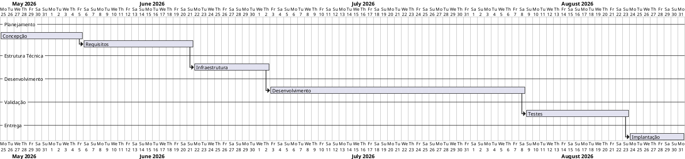

# 📅 Cronograma e Fluxo Técnico do Projeto



---

## 🔄 Fluxo Técnico

```text
Concepção
   ↓
Levantamento de Requisitos
   ↓
Configuração da Infraestrutura
   ↓
Desenvolvimento da Solução
   ↓
Testes e Validação
   ↓
Implantação Final
```

---

## 📌 Resumo do Cronograma

| Etapa | Objetivo | Duração |
|---|---|---|
| Concepção | Definição do projeto e escopo | 12 dias |
| Requisitos | Levantamento funcional e técnico | 16 dias |
| Infraestrutura | Configuração do ambiente | 11 dias |
| Desenvolvimento | Implementação da solução | 37 dias |
| Testes | Validação e correções | 15 dias |
| Implantação | Entrega e publicação final | 8 dias |

---

## ⚙️ Dependências

```text
Concepção
   → Requisitos
      → Infraestrutura
         → Desenvolvimento
            → Testes
               → Implantação
```