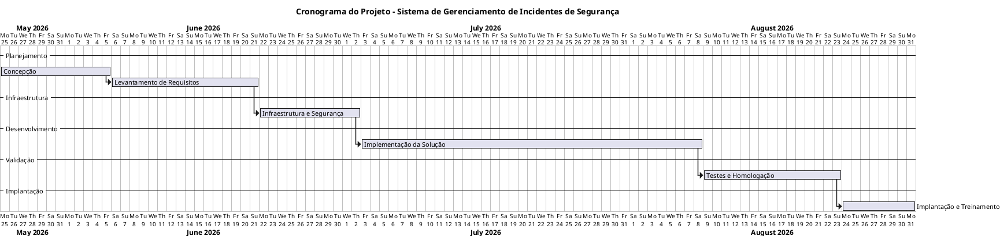

```plantuml
@startgantt
title Cronograma do Projeto - Sistema de Gerenciamento de Incidentes de Segurança

Project starts 2026-05-25

-- Planejamento --
[Concepção] lasts 12 days
[Levantamento de Requisitos] lasts 16 days

-- Infraestrutura --
[Infraestrutura e Segurança] lasts 11 days

-- Desenvolvimento --
[Implementação da Solução] lasts 37 days

-- Validação --
[Testes e Homologação] lasts 15 days

-- Implantação --
[Implantação e Treinamento] lasts 8 days

[Levantamento de Requisitos] starts at [Concepção]'s end
[Infraestrutura e Segurança] starts at [Levantamento de Requisitos]'s end
[Implementação da Solução] starts at [Infraestrutura e Segurança]'s end
[Testes e Homologação] starts at [Implementação da Solução]'s end
[Implantação e Treinamento] starts at [Testes e Homologação]'s end

@endgantt
```
